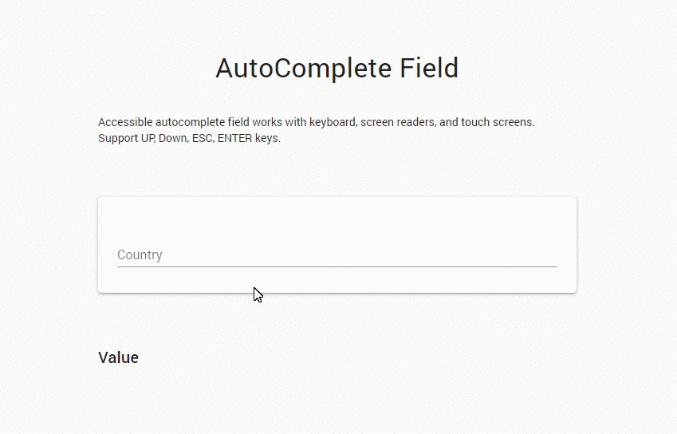

# Material-UI Autocomplete Component

Simple Autocomplete component built with Material-UI. Support accessibility and works with keyboard, screen readers, and touch screens.

### Suppored keys

- `UP`
- `Down`
- `ESC`
- `ENTER`
- `Mouse clicks`

### Dependencies

- [Material-UI](https://material-ui.com/) v4.11.0
- React version supports [Hooks](https://reactjs.org/docs/hooks-intro.html)



### Usage Example:

```jsx
import MuiAutoComplete from "./components/MuiAutoComplete"

const App = () => {
  // State
  const [inputValue, setInputValue] = useState("")

  // Handle Change
  const handleChange = e => setInputValue(e.target.value)

  // Handle Select
  const handleSelect = value => setInputValue(value)

  return (
    <div className="App">
      <MuiAutoComplete
        options={myArray}
        inputValue={inputValue}
        handleChange={handleChange}
        handleSelect={handleSelect}
      />
    </div>
  )
}
```

### [Demo](https://react-material-ui-autocomplete.vercel.app)

### [codeSandbox](https://codesandbox.io/s/react-material-ui-autocomplete-2xzponvj3n)
